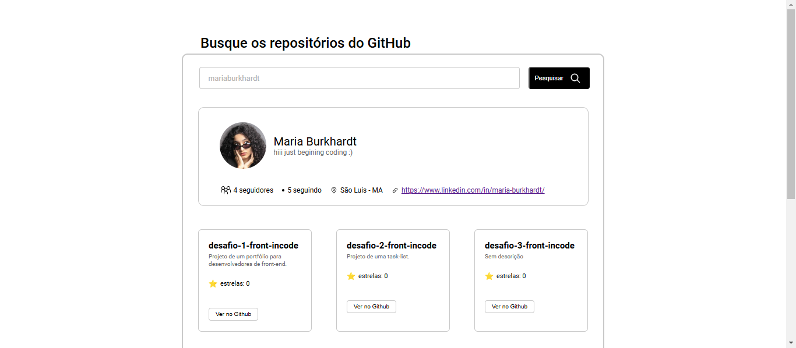

# 📲:Consumindo API

  

[Sobre](#hippopotamus-sobre) • [Demonstração](#desktop_computer-demonstração) • [Desenvolvido com](#rocket-desenvolvido-com)
 • [Protótipo](#jigsaw-protótipo) • [Como executar](#bulb-como-executar) • [Autoras](#star-autora)

### 💾: Sobre
Terceiro desafio da trilha de front-end da Incode Tech School, a criação de um tela que simula a pesquisa de usuários e de seus repositrios do GitHub consumindo a API fornecida pelo GitHub a partir de um protótipo feito no Figma. Para testar meus conhecimentos sobre Javascript e consumo de APIs.

---

### :desktop_computer: Demonstração

Atráves [deste link](https://mariaburkhardt.github.io/desafio-3-front-incode/) é possível acessar a página de demonstração do projeto no GitHub Pages.

---

### :rocket: Desenvolvido com

O Projeto foi desenvolvido utilizando as seguintes tecnologias e ferramentas

- VSCode
- HTML
- CSS
- Javascript

---

### :jigsaw: Protótipo

O protótipo da interface foi criado pelos instrutores do Incode Tech School, é possível acessa-lo através [deste link](https://www.figma.com/design/wNmsYJDaRfnATEQ8xdGOGX/github?node-id=0-1&t=Ib6ZEnjKtx3GJl0f-1).

---

### :round_pushpin: Como executar

Para visualizar o projeto localmente, basta clonar este repositório e abrir o arquivo [index.html](../index.html) em seu navegador.

---

### :bat: Autoras

<table>
  <tr>
    <td align="center">
      <a href="https://github.com/mariaburkhardt" title="defina o titulo do link">
         
        
          <b>Maria Burkhardt</b>
        
      </a>
    </td>
    <td align="center">
      <a href="https://github.com/luizabelfort" title="defina o titulo do link">
         
        
          <b>Luiza Belfort</b>
        
      </a>
    </td>
  </tr>
</table>

---
